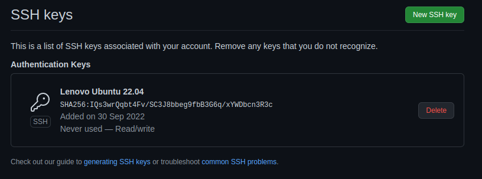
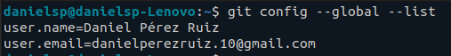

## Configuración de repositorio Git

### Infraestructura Virtual (2022/23)

Aquí se expone la configuración de la que dispone el repositorio de SuperCatch.

#### 1. Uso de claves pública/privada con SSH para mantenimiento del Git

Se han generado dos ficheros `id_rsa` y `id_rsa.pub` que son la clave privada y pública que utilizaré para mantener este repositorio:

~~~bash
danielsp@danielsp-Lenovo:~$ ssh-keygen
Generating public/private rsa key pair.
Enter file in which to save the key (/home/danielsp/.ssh/id_rsa): 
Enter passphrase (empty for no passphrase): 
Enter same passphrase again: 
Your identification has been saved in /home/danielsp/.ssh/id_rsa
Your public key has been saved in /home/danielsp/.ssh/id_rsa.pub
The key fingerprint is:
SHA256:XXXXXXXXXXXXXXXXXXXXXXXXXXXX danielsp@danielsp-Lenovo
The key's randomart image is:
+---[RSA 3072]----+
|    .            |
|   o .           |
|    = + .        |
|   . + + .   + o |
|. ..  . S   . B E|
|..  o   o  . ..+=|
| o. o+ o o. o  +o|
|o .ooo+ =. o oo.o|
| . . .o*....=+o..|
+----[SHA256]-----+
~~~

En la sección de *SSH and GPG keys*, he añadido una nueva clave SSH con el título del portátil y del SO con el que trabajaré habitualmente, siendo este el resultado final.

#### 2. Configuración de nombre y de correo para identificación adecuada

Se ha modificado los campos de git de "nombre" y "email" donde aparecen respectivamente mis nombres y apellidos, así como el email personal de gmail que utilizo. Aquí el resultado final.

